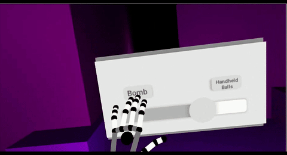
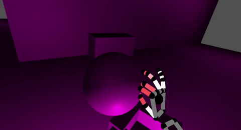
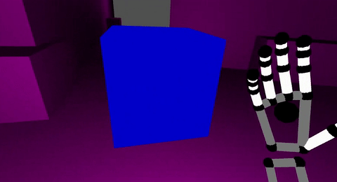

# Unity Haptic Authoring Tool

Haptic autoring tool for Unity3D that allows prototyping of tactile stimuli to be used in virtual reality environments. The tool is conceived as a proof of concept on how to integrate haptics into virtual reality in a simple and accessible way for designers, taking advantage of the potential of the technologies that are currently available.

## Features

* Creation of haptic interactive patterns inside a virtual development platform.
* Ability to design complex stimuli that involve several actuators in a timeline.
* Aimed to be used for designer without the need to write code.
* Association of vibrotactile actuators from an haptic device to a virtual hand skeleton.
* Virtual word object composition with haptics features.

## Requirements

The software works as an extension of Unity and in conjunction with the virtual reality development tools provided by Oculus and Leap Motion. However Oculus headset is optional.

Haptic rendering is based on vibrotactile actuators connected to PWM pins on an Arduino controller. This requires an Arduino board provided with the Firmata library and some actuators to cover the hand.

Current version works on [Unity 5.5.3][unity-download] and [Leap Motion Unity Assets v4.1.6][leap-motion-unity]

## Concept Tests

[unity-download]:https://unity3d.com/es/get-unity/download/archive
[leap-motion-unity]:https://github.com/leapmotion/UnityModules